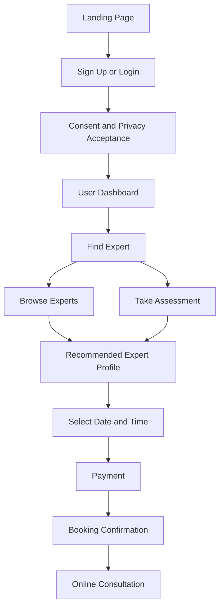
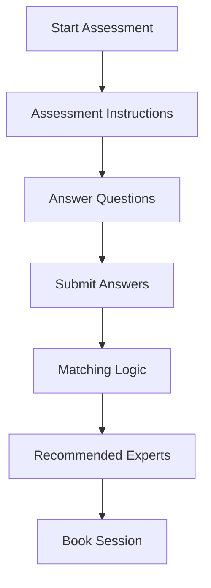
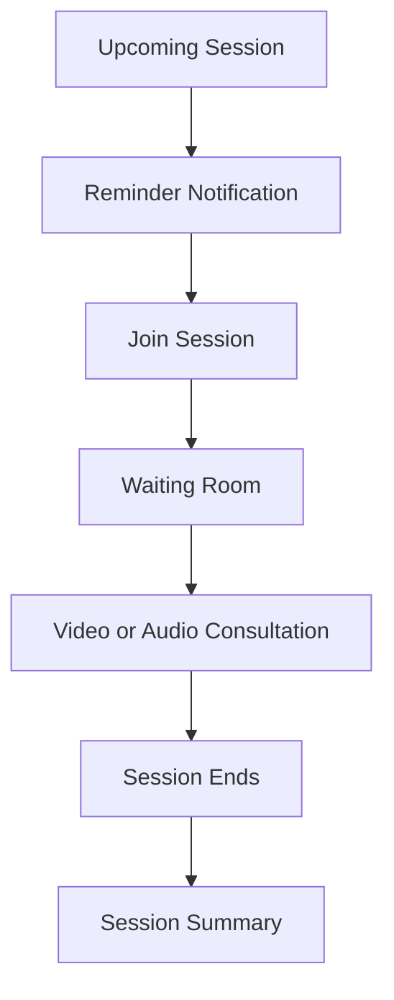
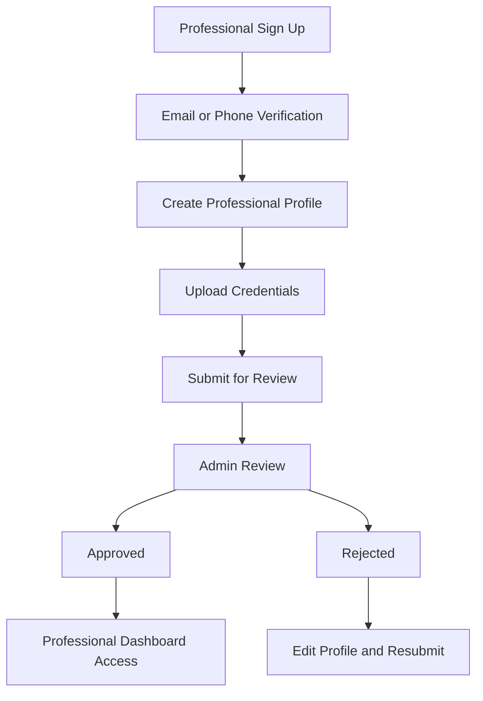
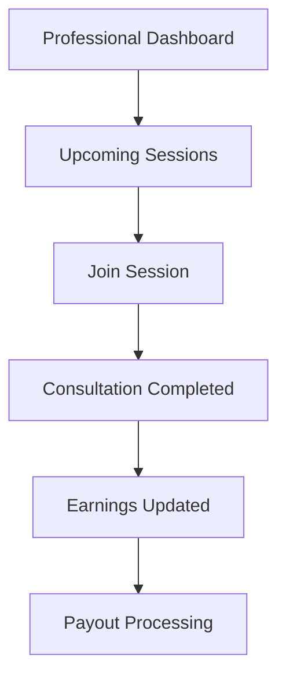
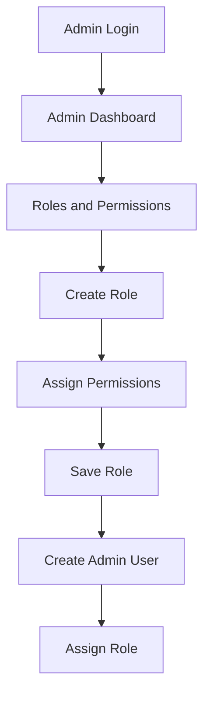

# Mindo Health – UX Flow Diagrams (Phase 1)

This document defines the core UX flows for the Mindo Health platform.
All diagrams are written using GitHub-compatible Mermaid syntax.

---

## 1. User Onboarding and Booking Flow

---

## 2. Assessment Based Expert Matching Flow

---

## 3. Consultation Flow

---

## 4. Professional Onboarding Flow

---

## 5. Professional Session and Earnings Flow

---

## 6. Admin Role and Permission Management Flow

